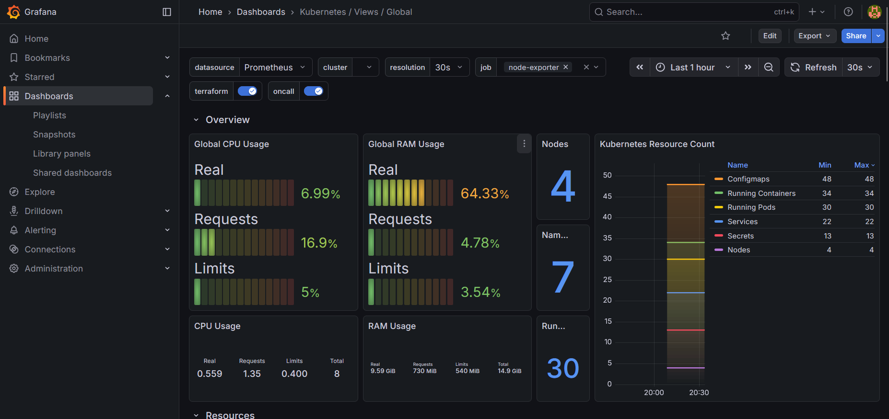
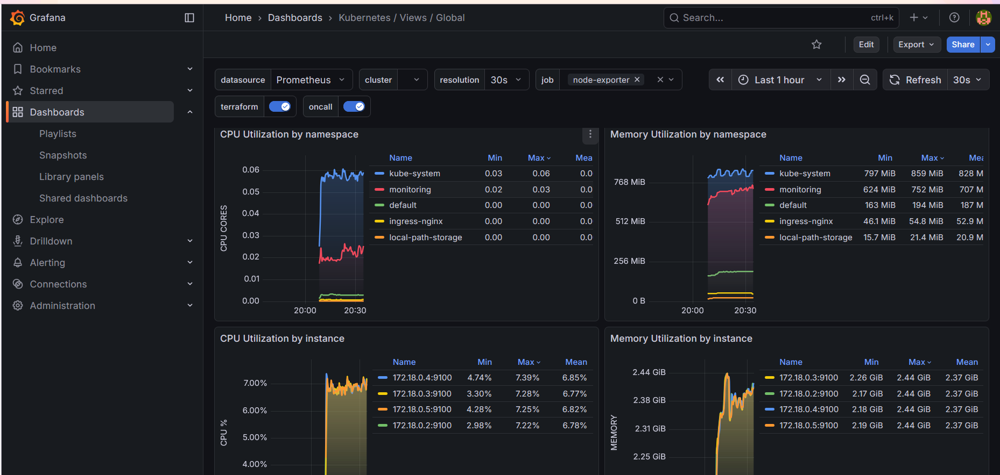

# 🚀 K8s Kind Voting App

**Author:** Onkar Ghugare  

This project demonstrates deploying a **simple Voting Application** on an **AWS EC2 instance using Kubernetes (Kind)** and adding **monitoring with Prometheus and Grafana using Helm**.

---

## 📌 Overview

In this project, I set up a local Kubernetes cluster using **Kind** on an AWS EC2 instance and deployed a microservices-based voting application.  
The goal is to gain hands-on experience with **Kubernetes deployment, service management, and observability**.

---

## 🧱 Application Architecture

The voting application consists of the following components:

- 🗳 **Vote App (Python)** – Front-end web app to cast votes  
- 🧰 **Redis** – Stores incoming votes temporarily  
- 🔄 **Worker (.NET)** – Processes votes from Redis  
- 💾 **PostgreSQL** – Stores vote data persistently  
- 📊 **Result App (Node.js)** – Displays voting results in real time  

---

## ⚙️ Tools & Technologies Used

- **AWS EC2** – Infrastructure  
- **Docker** – Containerization  
- **Kubernetes (Kind)** – Container orchestration  
- **kubectl** – Cluster management  
- **Helm** – Kubernetes package manager  
- **Prometheus** – Metrics collection  
- **Grafana** – Metrics visualization  

---

## 📊 Monitoring & Observability

- Installed **Prometheus and Grafana using Helm**
- Monitored Kubernetes cluster health
- Visualized CPU, memory, and pod metrics in Grafana dashboards
## 🏗️ Architecture

## 📊 Observability

### Grafana Dashboard 1

### Grafana Dashboard 2

## 🎯 Learning Outcomes

- Created and managed a Kubernetes cluster using Kind
- Deployed a multi-container application on Kubernetes
- Used Helm charts for monitoring setup
- Gained practical experience with Kubernetes observability

---

## 🚀 Future Improvements

- Add Ingress for external access  
- Implement CI/CD pipeline  
- Add alerting using Alertmanager  

---

## ⭐ Conclusion

This project helped me strengthen my **Kubernetes, Helm, and monitoring skills**, which are essential for a **DevOps Engineer** role.
